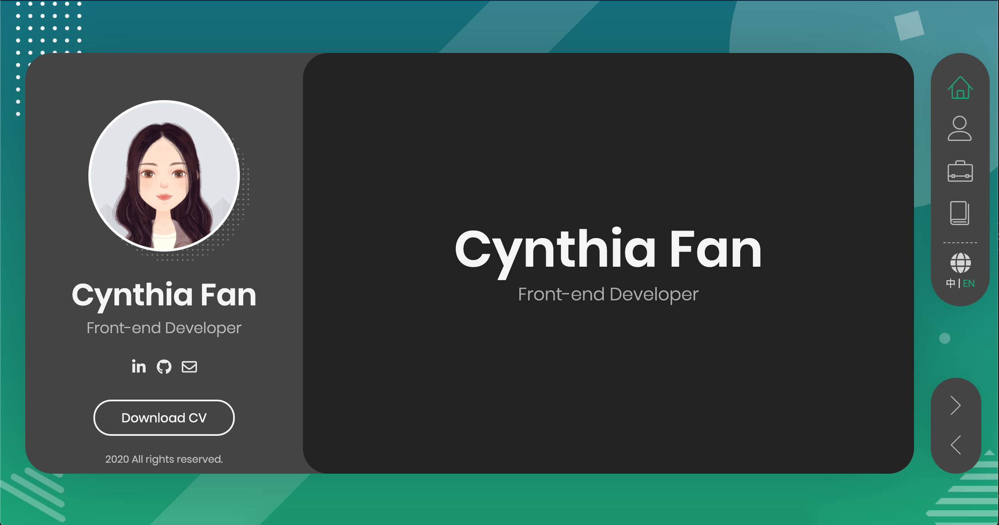

  

<h1 align="center">
  <a href="https://cynthiafan.com">cynthiafan.com</a>
</h1>

  Here's my personal website 🚀

  

---

## Copyright & License
Copyright (c) 2020 Cynthia Fan. Available under the MIT License.

Please note that the template is under the [Regular License of Envato](https://themeforest.net/licenses/terms/regular).

